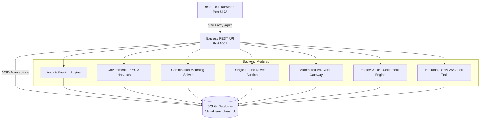

# 🌾 KISAN-DWAAR (किसान द्वार)
### *Next-Generation National Agricultural Trading & Smart Logistics Gateway*

[](https://opensource.org/licenses/MIT)
[](https://nodejs.org/)
[](https://www.typescriptlang.org/)
[](https://react.dev/)
[](https://www.sqlite.org/)
[](https://expressjs.com/)

---

## 📌 Executive Summary

**KISAN-DWAAR** is an end-to-end, government-supervised agricultural marketplace and intelligent logistics coordination platform. It solves market fragmentation for smallholder farmers by aggregating crop supply into dynamic multi-farmer clusters, coordinating competitive single-round freight reverse auctions via automated IVR voice broadcasts, and securing financial settlements through official warehouse QR inspections and Direct Bank Transfer (DBT) Escrow releases.

---

## 🏛️ Key Capabilities & Features

### 1. 🛡️ Official Government e-KYC & Harvest Registry
- **Aadhaar e-KYC Verification**: Only authorized Mandi / Panchayat officials can onboard farmers, buyers, and transporters with biometric and Aadhaar validation.
- **Official Crop Inward Entry**: Farmers contact their local officer to record crop yields and establish a legally protected **minimum reserve price (₹/kg)**.

### 2. ⚖️ Multi-Farmer Aggregation & Combination Solver
- **Cluster Combinations**: When a corporate buyer submits bulk crop demand (e.g. 5,000 kg), our optimization algorithm evaluates single-farmer lots and multi-farmer clusters across adjacent villages.
- **Contract Locking**: Buyers review average prices, distance estimates, and village pickup routes before locking the deal into government escrow.

### 3. 📞 Automated IVR & Sealed Single-Round Reverse Auction
- **Telecom Voice Gateway (Simulated IVR)**: Upon deal confirmation, automated phone calls broadcast to all registered local carriers with DTMF keypad interactive prompts in Hindi & English.
- **Fair Single-Round Bidding**: Transporters enter a single sealed rate quote per quintal-kilometer. Counter-bidding is strictly prohibited. The lowest compliant quote automatically wins the delivery manifest.

### 4. 📦 Warehouse QR Verification & DBT Escrow Settlement
- **Digital Manifests**: Transporters track pickup progress and navigate to warehouse destinations.
- **Physical Inspection Sign-Off**: Government Mandi inspectors scan the consignment QR code, verify weights and grade conformity, and digitally sign off.
- **Instant Escrow Disbursement**: Held buyer funds are automatically released directly to individual farmer bank accounts via Direct Benefit Transfer (DBT).

### 5. 📈 Live Regional APMC Price Discovery
- Live price benchmarks mapped across **50+ APMC Mandi regions in India** (e.g. Aligarh, Indore, Khanna, Guntur, Hapur, etc.), taking MSP baselines and quality grades into account.

---

## 🏗️ System Architecture



---

## 💻 Tech Stack

- **Frontend**: React 18, TypeScript, Tailwind CSS, Lucide Icons, Canvas Confetti.
- **Backend**: Express.js, TypeScript, Node.js (`tsx`).
- **Database**: SQLite with `better-sqlite3` in WAL (Write-Ahead Logging) mode.
- **Communication & Tooling**: Axios, Concurrently, Vite Proxy, Dotenv.

---

## 🗄️ Database Schema

The SQLite schema consists of **14 relational tables**:
1. `farmers`: Aadhaar-verified farmer profiles and contact details.
2. `farmer_inventory`: Verified crop lots with quantity, grade, and minimum demand rate.
3. `buyers`: Verified corporate buyer accounts and GSTIN tax IDs.
4. `transporters`: Registered commercial carriers with vehicle numbers and ratings.
5. `demands`: Active and matched buyer procurement orders.
6. `pools`: Multi-farmer aggregation clusters.
7. `pool_farmers`: Allocated quantity and payout breakdown per farmer.
8. `offers`: Individual farmer contract proposals.
9. `transport_bids`: Sealed single-round carrier rate quotes.
10. `deliveries`: Consignment manifests and tracking statuses.
11. `delivery_pickups`: Village-wise farm gate pickup waypoints.
12. `escrows`: Payment lock accounts with transaction references.
13. `audit_logs`: Immutable hash-linked ledger recording every system event.
14. `call_logs`: Telephony IVR records with durations and DTMF keypress sequences.

---

## 🚀 Quick Start Guide

### Prerequisites
- **Node.js**: v18.0.0 or higher
- **npm**: v9.0.0 or higher

### 1. Clone & Install Dependencies
```bash
git clone <your-github-repo-url>
cd SIH
npm install
```

### 2. Environment Configuration
Create a `.env` file from the provided template:
```bash
cp .env.example .env
```
Default `.env` configuration:
```env
PORT=5001
VITE_API_URL=http://localhost:5001
DATABASE_PATH=./data/kisan_dwaar.db
JWT_SECRET=kisan-dwaar-secure-secret-key
NODE_ENV=development
```

### 3. Run Application in Development Mode
```bash
npm run dev
```
> This command starts both the **Express SQLite API server (port 5001)** and the **Vite frontend (port 5173)** concurrently.

Open your browser at **`http://localhost:5173`**.

---

## 🧪 Testing the End-to-End Flow

| Step | Action | Portal / Page |
| :--- | :--- | :--- |
| **1** | Onboard a new farmer using Aadhaar KYC & register a crop lot with minimum price | `/government` |
| **2** | Submit crop demand, view candidate multi-farmer combinations, and lock deal into Escrow | `/buyer` |
| **3** | Answer automated simulated voice call, select language, and confirm offer commitment | `/ivr` or `/farmer` |
| **4** | Submit single sealed rate quote per quintal-km; lowest bid automatically wins manifest | `/transporter` |
| **5** | Perform warehouse physical inspection, verify QR manifest, and disburse Escrow via DBT | `/government` |
| **6** | Restart server (`Ctrl+C` then `npm run dev`) and refresh page to verify SQLite data persistence | Full App |

---

## 📂 Project Structure

```
SIH/
├── data/                  # SQLite database location (auto-seeded on startup)
│   └── .gitkeep
├── public/                # Static assets & public images
├── server/                # Express REST API Backend
│   ├── routes/            # Modular endpoint routers
│   │   ├── auth.ts
│   │   ├── farmers.ts
│   │   ├── buyers.ts
│   │   ├── transporters.ts
│   │   ├── combinations.ts
│   │   ├── pools.ts
│   │   ├── deliveries.ts
│   │   ├── escrows.ts
│   │   ├── pricing.ts
│   │   ├── audit.ts
│   │   └── ivr.ts
│   ├── db.ts              # SQLite database connection & schema
│   ├── seed.ts            # Default seed data generator
│   └── index.ts           # Express server entry point
├── src/                   # React Frontend
│   ├── components/        # Reusable UI components & Header
│   ├── context/           # Global AppContext & backend sync
│   ├── data/              # Static reference mappings
│   ├── portal/            # Role-specific portal views
│   │   ├── login.tsx
│   │   ├── farmer.tsx
│   │   ├── buyer.tsx
│   │   ├── transporter.tsx
│   │   ├── government.tsx
│   │   └── ivr.tsx
│   ├── services/          # Typed Axios API client
│   ├── types/             # TypeScript data contracts
│   ├── utils/             # Business rules & price discovery
│   ├── App.tsx            # Routes & Layout
│   └── main.tsx           # React bootstrap
├── .env.example           # Environment template
├── .gitignore             # Git ignore configuration
├── LICENSE                # MIT License
├── package.json           # Scripts and dependencies
├── tailwind.config.js     # Tailwind design system
├── tsconfig.json          # TypeScript compiler config
└── vite.config.ts         # Vite configuration with /api proxy
```

---

## 📜 License

This project is licensed under the **MIT License** - see the [LICENSE](LICENSE) file for details.
